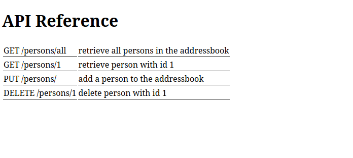
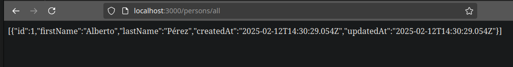

	# Práctica 6.1 - Dockerización del despliegue de una aplicación con Node.js

## Despliegue con Docker

Para realizar esta práctica de despliegue con Docker será 
necesario tener disponible una aplicación que desplegar en primer lugar.
Para ello, clonaré un repositorio de GitHub ejecutando:

```console
git clone https://github.com/raul-profesor/DAW_practica_6.1_2024.git
```

Este repositorio ya contiene un documento Dockerfile, pero es necesario 
modificar su contenido para poder realizar el despliegue correctamente. 

En este caso, el contenido de este archivo será:

```console
FROM node:18.16.0-alpine3.17
RUN  mkdir -p /opt/app
WORKDIR /opt/app
COPY src/package.json src/package-lock.json .
RUN npm install
COPY src/ .
EXPOSE 3000
CMD [ "npm", "start"]
```

|Comando|Explicación|
|-------|-----------|
|FROM node:18.16.0-alpine3.17|Indica que las imágenes base de esta aplicación serán la imágenes oficiales de Node y Alpine Linux en Docker Hub|
|RUN  mkdir -p /opt/app|Se crea el directorio /opt/app dentro de una nueva capa de la imagen base que estamos utilizando|
|WORKDIR /opt/app|Establece '/opt/app/ como el directorio de trabajo a utilizar. Todas las instrucciones se ejecutarán desde esta ruta a partir de ahora|
|COPY src/package.json src/package-lock.json .|Se copian estos archivos de la máquina local a la imagen de Docker|
|RUN npm install|Se ejecuta 'npm install' dentro de la imagen de Docker|
|COPY src/ .|Se copian el resto de contenidos de src/ (de la máquina local) a la imagen de Docker|
|EXPOSE 3000|Indica que el contenedor, en tiempo de ejecución, debe 'escuchar' en el puerto 3000|
|CMD [ "npm", "start"]|Indica que el contenedor, al ser arrancado, debe ejecutar 'npm start', lo que hará que arranque la ejecución de la aplicación|


Con nuestro archivo Dockerfile preparado, podemos 'construir' la imagen de 
Docker. Para ello sólo hay que ejecutar: 

```console
docker build -t librodirecciones .
```

Para ejecutar la aplicación 'dockerizada' y comprobar su buen funcionamiento, 
hay que ejecutar: 

```console
$ docker run -p 3000:3000 -d librodirecciones
```

Si accedemos al puerto 3000, tendremos acceso a una referencia de la API 
de la aplicación: 




## Docker Compose

Para gestionar el contenedor de la aplicación junto con otro que 
se encargue de dar servicio de persistencia de datos, el repositorio 
contiene un archivo 'docker-compose.yml'. A partir de este archivo, 
levantaremos la infraestructura completa de la aplicación (los dos 
contenedores que actualmente la componen). Para ello, hay que ejecutar:

```console
docker compose run addressbook npm run migrate  # Se crean las tablas de la BBDD
```

```console
docker compose up --build -d  # Se construyen los contenedores de la aplicación
```

Ahora, para comprobar el buen funcionamiento de la aplicación, voy a realizar 
una petición PUT para insertar datos dentro de la BBDD de la aplicación, 
ejecutando:

```console
curl -X PUT http://localhost:3000/persons -H'Content-Type: application/json' -d '{"id": 1, "firstName": "Alberto", "lasName": "Pérez"}'
```

Si ahora, desde el navegador, accedo a la ruta que realiza la petición GET de 
todos los datos de la tabla, muestra:


